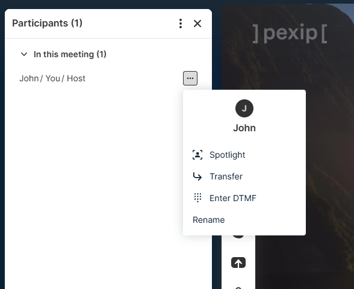
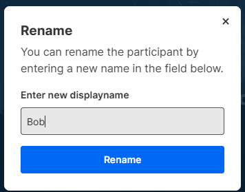
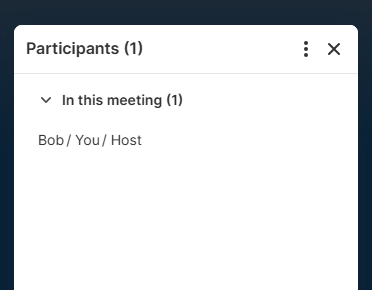

# Web App 3 Plugin: Rename Participant

This plugin allows hosts to rename participants in the participant list. When
the host clicks the "Rename Participant" entry in the participant action menu, a
modal appears. The new name can be provided and will be set to the related
patient.

## How to use

A additional entry appears in the participant action menu in participant list.

<div align='center'>



</div>

This item opens a dialog to rename to participant.

<div align='center'>



</div>

Provide the new name and click rename.

<div align='center'>



</div>

The applied name will be shown in participant list

## Limitations

- Currently entries in participant menu do not support icons when added by
  plugin.
- Technically the overlay_text is overwritten and shown in the participant list,
  the actual display name does not change.

  See
  [Overlay Text API](https://docs.pexip.com/api_client/api_rest.htm#overlaytext)

- SSO authenticated participants can not be renamed. In this case the entry does
  not appear for these participants.

## Run for development

- To be able to build the plugin, you need to comply with the following versions
  or higher:

  | NodeJS   | NPM     |
  | -------- | ------- |
  | v20.12.2 | v10.5.0 |

- Install all the dependencies:

```bash
$ npm i
```

- Run the dev environment:

```bash
$ npm start
```

The plugin will be served from https://localhost:5173 (visit that page and
accept the self-signed certificates), but you should access it thought the Web
App 3 URL. You have more information about how to configure your environment in
the
[Developer Portal: Setup guide for plugin developers](https://developer.pexip.com/docs/plugins/webapp-3/setup-guide-for-plugin-developers).

## Build for production

To create a package, you will need to first install all the dependencies:

```bash
$ npm i
```

And now to create the package itself:

```bash
$ npm run build
```

Congrats! Your package is ready and it will be available in the `dist` folder.
The next step is to create a Web App3 branding and copy `dist` into that
branding.

If you want to know more about how to deploy your plugin in Pexip Infinity,
check our [Developer Portal](https://developer.pexip.com).
